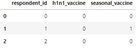

# Прогнозирование вакцин против гриппа H1N1 с помощью AutoML
Используя методы автоматической генерации признаков и построения моделей, получить решение по прогнозированию вероятности получения вакцины против H1N1 и сезонного гриппа. Сравнить качество полученных решений с бейзлайном и любой парой моделей "из коробки". Исходные данные по вакцинации против гриппа на https://www.drivendata.org/competitions/66/flu-shot-learning/page/211/

## Подключение библиотек
```python
# Импорт основных библиотек
import numpy as np
import pandas as pd

# Импорт библиотек машинного обучения
from sklearn.model_selection import train_test_split
from sklearn.pipeline import Pipeline
from sklearn.impute import SimpleImputer
from sklearn.preprocessing import OneHotEncoder, StandardScaler
from sklearn.feature_selection import VarianceThreshold, SelectKBest, chi2
from sklearn.multioutput import MultiOutputClassifier
from sklearn.metrics import roc_auc_score
from sklearn.naive_bayes import GaussianNB
from lightgbm import LGBMClassifier

# Импорт библиотек генерации новых признаков
import featuretools as ft

# Импорт библиотек AutoML
from h2o.sklearn import H2OAutoMLClassifier
from tpot import TPOTClassifier
```

## Загрузка исходных данных
```python
features_data = pd.read_csv('training_set_features.csv', low_memory=False, nrows=5000)
features_data.head(3)
```


```python
labels_data = pd.read_csv('training_set_labels.csv', low_memory= False, nrows=5000)
labels_data.head(3)
```


```python
vaccines_data = features_data.merge(labels_data, on='respondent_id')
vaccines_data.head(3)
```


## Разведочный анализ
```python
# Вывод информации о структуре исходных данных
vaccines_data.info()
```
```
<class 'pandas.core.frame.DataFrame'>
Int64Index: 5000 entries, 0 to 4999
Data columns (total 38 columns):
 #   Column                       Non-Null Count  Dtype  
---  ------                       --------------  -----  
 0   respondent_id                5000 non-null   int64  
 1   h1n1_concern                 4981 non-null   float64
 2   h1n1_knowledge               4978 non-null   float64
 3   behavioral_antiviral_meds    4985 non-null   float64
 4   behavioral_avoidance         4957 non-null   float64
 5   behavioral_face_mask         4996 non-null   float64
 6   behavioral_wash_hands        4994 non-null   float64
 7   behavioral_large_gatherings  4988 non-null   float64
 8   behavioral_outside_home      4981 non-null   float64
 9   behavioral_touch_face        4971 non-null   float64
 10  doctor_recc_h1n1             4601 non-null   float64
 11  doctor_recc_seasonal         4601 non-null   float64
 12  chronic_med_condition        4834 non-null   float64
 13  child_under_6_months         4860 non-null   float64
 14  health_worker                4863 non-null   float64
 15  health_insurance             2714 non-null   float64
 16  opinion_h1n1_vacc_effective  4920 non-null   float64
 17  opinion_h1n1_risk            4931 non-null   float64
 18  opinion_h1n1_sick_from_vacc  4928 non-null   float64
 19  opinion_seas_vacc_effective  4918 non-null   float64
 20  opinion_seas_risk            4911 non-null   float64
 21  opinion_seas_sick_from_vacc  4904 non-null   float64
 22  age_group                    5000 non-null   object 
 23  education                    4738 non-null   object 
 24  race                         5000 non-null   object 
 25  sex                          5000 non-null   object 
 26  income_poverty               4205 non-null   object 
 27  marital_status               4738 non-null   object 
 28  rent_or_own                  4606 non-null   object 
 29  employment_status            4718 non-null   object 
 30  hhs_geo_region               5000 non-null   object 
 31  census_msa                   5000 non-null   object 
 32  household_adults             4957 non-null   float64
 33  household_children           4957 non-null   float64
 34  employment_industry          2471 non-null   object 
 35  employment_occupation        2454 non-null   object 
 36  h1n1_vaccine                 5000 non-null   int64  
 37  seasonal_vaccine             5000 non-null   int64  
dtypes: float64(23), int64(3), object(12)
memory usage: 1.5+ MB
```

```python
# Вывод доли отсутствующей информации в признаках
vaccines_data.isna().sum() / len(vaccines_data) * 100
```
```
respondent_id                   0.00
h1n1_concern                    0.38
h1n1_knowledge                  0.44
behavioral_antiviral_meds       0.30
behavioral_avoidance            0.86
behavioral_face_mask            0.08
behavioral_wash_hands           0.12
behavioral_large_gatherings     0.24
behavioral_outside_home         0.38
behavioral_touch_face           0.58
doctor_recc_h1n1                7.98
doctor_recc_seasonal            7.98
chronic_med_condition           3.32
child_under_6_months            2.80
health_worker                   2.74
health_insurance               45.72
opinion_h1n1_vacc_effective     1.60
opinion_h1n1_risk               1.38
opinion_h1n1_sick_from_vacc     1.44
opinion_seas_vacc_effective     1.64
opinion_seas_risk               1.78
opinion_seas_sick_from_vacc     1.92
age_group                       0.00
education                       5.24
race                            0.00
sex                             0.00
income_poverty                 15.90
marital_status                  5.24
rent_or_own                     7.88
employment_status               5.64
hhs_geo_region                  0.00
census_msa                      0.00
household_adults                0.86
household_children              0.86
employment_industry            50.58
employment_occupation          50.92
h1n1_vaccine                    0.00
seasonal_vaccine                0.00
dtype: float64
```

```python
# Удаление признаков с большим количеством пропусков
vaccines_data = vaccines_data.drop(columns=['health_insurance', 'employment_industry', 'employment_occupation'])
```

```python
# Вывод уникальных значений для каждого признака
unique_values = {column: vaccines_data[column].unique().tolist() for column in vaccines_data.columns}
pd.Series(unique_values)
```

```
respondent_id                  [0, 1, 2, 3, 4, 5, 6, 7, 8, 9, 10, 11, 12, 13,...
h1n1_concern                                           [1.0, 3.0, 2.0, 0.0, nan]
h1n1_knowledge                                              [0.0, 2.0, 1.0, nan]
behavioral_antiviral_meds                                        [0.0, 1.0, nan]
behavioral_avoidance                                             [0.0, 1.0, nan]
behavioral_face_mask                                             [0.0, 1.0, nan]
behavioral_wash_hands                                            [0.0, 1.0, nan]
behavioral_large_gatherings                                      [0.0, 1.0, nan]
behavioral_outside_home                                          [1.0, 0.0, nan]
behavioral_touch_face                                            [1.0, 0.0, nan]
doctor_recc_h1n1                                                 [0.0, nan, 1.0]
doctor_recc_seasonal                                             [0.0, nan, 1.0]
chronic_med_condition                                            [0.0, 1.0, nan]
child_under_6_months                                             [0.0, 1.0, nan]
health_worker                                                    [0.0, 1.0, nan]
opinion_h1n1_vacc_effective                       [3.0, 5.0, 4.0, 2.0, 1.0, nan]
opinion_h1n1_risk                                 [1.0, 4.0, 3.0, 2.0, 5.0, nan]
opinion_h1n1_sick_from_vacc                       [2.0, 4.0, 1.0, 5.0, 3.0, nan]
opinion_seas_vacc_effective                       [2.0, 4.0, 5.0, 3.0, 1.0, nan]
opinion_seas_risk                                 [1.0, 2.0, 4.0, 3.0, 5.0, nan]
opinion_seas_sick_from_vacc                       [2.0, 4.0, 1.0, 5.0, nan, 3.0]
age_group                      [55 - 64 Years, 35 - 44 Years, 18 - 34 Years, ...
education                      [< 12 Years, 12 Years, College Graduate, Some ...
race                                 [White, Black, Other or Multiple, Hispanic]
sex                                                               [Female, Male]
income_poverty                 [Below Poverty, <= $75,000, Above Poverty, > $...
marital_status                                       [Not Married, Married, nan]
rent_or_own                                                     [Own, Rent, nan]
employment_status                [Not in Labor Force, Employed, Unemployed, nan]
hhs_geo_region                 [oxchjgsf, bhuqouqj, qufhixun, lrircsnp, atmpe...
census_msa                     [Non-MSA, MSA, Not Principle  City, MSA, Princ...
household_adults                                       [0.0, 2.0, 1.0, 3.0, nan]
household_children                                     [0.0, 3.0, 2.0, 1.0, nan]
h1n1_vaccine                                                              [0, 1]
seasonal_vaccine                                                          [0, 1]
dtype: object
```

## Предобработка данных
```python
# Разбиение данных на тренировочную и тестовую выборки
train_data, test_data = train_test_split(vaccines_data, train_size=0.8, stratify=vaccines_data.iloc[:, -2:], random_state=42)
```

## Создание новых признаков
```python
# Создание объекта класса EntitySet и наполнение таблицами данных
es = ft.EntitySet(id='vaccines')
es.add_dataframe(train_data.iloc[:, :-2], 'vaccines_train', 'respondent_id')
es.add_dataframe(test_data.iloc[:, :-2], 'vaccines_test', 'respondent_id')
```
```
Entityset: vaccines
  DataFrames:
    vaccines_train [Rows: 4000, Columns: 33]
    vaccines_test [Rows: 1000, Columns: 33]
  Relationships:
    No relationships
```

```python
# Вывод структуры данных в объекте EntitySet
pd.Series(es['vaccines_train'].ww.semantic_tags)
```
```
respondent_id                     {index}
h1n1_concern                    {numeric}
h1n1_knowledge                  {numeric}
behavioral_antiviral_meds       {numeric}
behavioral_avoidance            {numeric}
behavioral_face_mask            {numeric}
behavioral_wash_hands           {numeric}
behavioral_large_gatherings     {numeric}
behavioral_outside_home         {numeric}
behavioral_touch_face           {numeric}
doctor_recc_h1n1                {numeric}
doctor_recc_seasonal            {numeric}
chronic_med_condition           {numeric}
child_under_6_months            {numeric}
health_worker                   {numeric}
opinion_h1n1_vacc_effective     {numeric}
opinion_h1n1_risk               {numeric}
opinion_h1n1_sick_from_vacc     {numeric}
opinion_seas_vacc_effective     {numeric}
opinion_seas_risk               {numeric}
opinion_seas_sick_from_vacc     {numeric}
age_group                      {category}
education                      {category}
race                           {category}
sex                            {category}
income_poverty                 {category}
marital_status                 {category}
rent_or_own                    {category}
employment_status              {category}
hhs_geo_region                 {category}
census_msa                     {category}
household_adults                {numeric}
household_children              {numeric}
dtype: object
```

```python
# Построение новых признаков для тренировочного набора данных
feature_train, feature_defs = ft.dfs(
    entityset=es,
    target_dataframe_name='vaccines_train',
    trans_primitives=['cum_mean', 'diff', 'percentile', 'divide_by_feature'],
    max_features=100,
    chunk_size=2000,
    max_depth=1,
    n_jobs=-1
)

# Построение новых признаков для тренировочного набора данных
feature_test, _ = ft.dfs(
    entityset=es,
    target_dataframe_name='vaccines_test',
    trans_primitives=['cum_mean', 'diff', 'percentile', 'divide_by_feature'],
    max_features=100,
    chunk_size=2000,
    max_depth=1,
    n_jobs=-1
)

# Вывод списка новых признаков
feature_defs
```
```
Fewer chunks (2), than workers (8) consider reducing the chunk size
EntitySet scattered to 8 workers in 4 seconds
Fewer chunks (1), than workers (8) consider reducing the chunk size
EntitySet scattered to 8 workers in 5 seconds
[<Feature: h1n1_concern>,
 <Feature: h1n1_knowledge>,
 <Feature: behavioral_antiviral_meds>,
 <Feature: behavioral_avoidance>,
 <Feature: behavioral_face_mask>,
 <Feature: behavioral_wash_hands>,
 <Feature: behavioral_large_gatherings>,
 <Feature: behavioral_outside_home>,
 <Feature: behavioral_touch_face>,
 <Feature: doctor_recc_h1n1>,
 <Feature: doctor_recc_seasonal>,
 <Feature: chronic_med_condition>,
 <Feature: child_under_6_months>,
 <Feature: health_worker>,
 <Feature: opinion_h1n1_vacc_effective>,
 <Feature: opinion_h1n1_risk>,
 <Feature: opinion_h1n1_sick_from_vacc>,
 <Feature: opinion_seas_vacc_effective>,
 <Feature: opinion_seas_risk>,
 <Feature: opinion_seas_sick_from_vacc>,
 <Feature: age_group>,
 <Feature: education>,
 <Feature: race>,
 <Feature: sex>,
 <Feature: income_poverty>,
 <Feature: marital_status>,
 <Feature: rent_or_own>,
 <Feature: employment_status>,
 <Feature: hhs_geo_region>,
 <Feature: census_msa>,
 <Feature: household_adults>,
 <Feature: household_children>,
 <Feature: CUM_MEAN(behavioral_antiviral_meds)>,
 <Feature: CUM_MEAN(behavioral_avoidance)>,
 <Feature: CUM_MEAN(behavioral_face_mask)>,
 <Feature: CUM_MEAN(behavioral_large_gatherings)>,
 <Feature: CUM_MEAN(behavioral_outside_home)>,
 <Feature: CUM_MEAN(behavioral_touch_face)>,
 <Feature: CUM_MEAN(behavioral_wash_hands)>,
 <Feature: CUM_MEAN(child_under_6_months)>,
 <Feature: CUM_MEAN(chronic_med_condition)>,
 <Feature: CUM_MEAN(doctor_recc_h1n1)>,
 <Feature: CUM_MEAN(doctor_recc_seasonal)>,
 <Feature: CUM_MEAN(h1n1_concern)>,
 <Feature: CUM_MEAN(h1n1_knowledge)>,
 <Feature: CUM_MEAN(health_worker)>,
 <Feature: CUM_MEAN(household_adults)>,
 <Feature: CUM_MEAN(household_children)>,
 <Feature: CUM_MEAN(opinion_h1n1_risk)>,
 <Feature: CUM_MEAN(opinion_h1n1_sick_from_vacc)>,
 <Feature: CUM_MEAN(opinion_h1n1_vacc_effective)>,
 <Feature: CUM_MEAN(opinion_seas_risk)>,
 <Feature: CUM_MEAN(opinion_seas_sick_from_vacc)>,
 <Feature: CUM_MEAN(opinion_seas_vacc_effective)>,
 <Feature: DIFF(behavioral_antiviral_meds)>,
 <Feature: DIFF(behavioral_avoidance)>,
 <Feature: DIFF(behavioral_face_mask)>,
 <Feature: DIFF(behavioral_large_gatherings)>,
 <Feature: DIFF(behavioral_outside_home)>,
 <Feature: DIFF(behavioral_touch_face)>,
 <Feature: DIFF(behavioral_wash_hands)>,
 <Feature: DIFF(child_under_6_months)>,
 <Feature: DIFF(chronic_med_condition)>,
 <Feature: DIFF(doctor_recc_h1n1)>,
 <Feature: DIFF(doctor_recc_seasonal)>,
 <Feature: DIFF(h1n1_concern)>,
 <Feature: DIFF(h1n1_knowledge)>,
 <Feature: DIFF(health_worker)>,
 <Feature: DIFF(household_adults)>,
 <Feature: DIFF(household_children)>,
 <Feature: DIFF(opinion_h1n1_risk)>,
 <Feature: DIFF(opinion_h1n1_sick_from_vacc)>,
 <Feature: DIFF(opinion_h1n1_vacc_effective)>,
 <Feature: DIFF(opinion_seas_risk)>,
 <Feature: DIFF(opinion_seas_sick_from_vacc)>,
 <Feature: DIFF(opinion_seas_vacc_effective)>,
 <Feature: 1 / behavioral_antiviral_meds>,
 <Feature: 1 / behavioral_avoidance>,
 <Feature: 1 / behavioral_face_mask>,
 <Feature: 1 / behavioral_large_gatherings>,
 <Feature: 1 / behavioral_outside_home>,
 <Feature: 1 / behavioral_touch_face>,
 <Feature: 1 / behavioral_wash_hands>,
 <Feature: 1 / child_under_6_months>,
 <Feature: 1 / chronic_med_condition>,
 <Feature: 1 / doctor_recc_h1n1>,
 <Feature: 1 / doctor_recc_seasonal>,
 <Feature: 1 / h1n1_concern>,
 <Feature: 1 / h1n1_knowledge>,
 <Feature: 1 / health_worker>,
 <Feature: 1 / household_adults>,
 <Feature: 1 / household_children>,
 <Feature: 1 / opinion_h1n1_risk>,
 <Feature: 1 / opinion_h1n1_sick_from_vacc>,
 <Feature: 1 / opinion_h1n1_vacc_effective>,
 <Feature: 1 / opinion_seas_risk>,
 <Feature: 1 / opinion_seas_sick_from_vacc>,
 <Feature: 1 / opinion_seas_vacc_effective>,
 <Feature: PERCENTILE(behavioral_antiviral_meds)>,
 <Feature: PERCENTILE(behavioral_avoidance)>]
```

## Построение моделей
```python
# Разбиение данных на признаки и целевые переменные (целевых переменных две)
X_train, Y_train = train_data.iloc[:, 1:-2].values, train_data.iloc[:, -2:].values
X_test, Y_test = test_data.iloc[:, 1:-2].values, test_data.iloc[:, -2:].values

# Определение новых сгенерированных признаков
X_train_features = feature_train.values
X_test_features = feature_test.values
```

### Базовая модель
#### Предсказание двух целевых классов (multilabels)
```python
# Построение базовой модели классификации
lgbm_pipeline = Pipeline([
    ('imputer', SimpleImputer(strategy='most_frequent')),
    ('encoder', OneHotEncoder(drop='first')),
    ('var_select', VarianceThreshold(0.001)),
    ('chi2_select', SelectKBest(chi2, k=10)),
    ('classifier', MultiOutputClassifier(LGBMClassifier()))
])

lgbm_model = lgbm_pipeline.fit(X_train, Y_train)

# Вывод количества значимых признаков и оценки качества модели
feature_importances = lgbm_pipeline['classifier'].estimators_[1].feature_importances_
feature_importances = feature_importances[feature_importances > 0].shape[0]
print('Значимых признаков: {:0d}'.format(feature_importances))

score = roc_auc_score(Y_test, lgbm_model.predict(X_test), average='macro')
print('ROC-AUC: {:0.2f}'.format(score))
```
```
Значимых признаков: 10
ROC-AUC: 0.72
```

#### Предсказание одного целевого класса
```python
# Построение базовой модели классификации
lgbm_pipeline = Pipeline([
    ('imputer', SimpleImputer(strategy='most_frequent')),
    ('encoder', OneHotEncoder(drop='first')),
    ('var_select', VarianceThreshold(0.001)),
    ('chi2_select', SelectKBest(chi2, k=10)),
    ('classifier', LGBMClassifier())
])

lgbm_model = lgbm_pipeline.fit(X_train, Y_train[:, 0])

# Вывод количества значимых признаков и оценки качества модели
feature_importances = lgbm_pipeline['classifier'].feature_importances_
feature_importances = feature_importances[feature_importances > 0].shape[0]
print('Значимых признаков: {:0d}'.format(feature_importances))

score = roc_auc_score(Y_test[:, 0], lgbm_model.predict(X_test))
print('ROC-AUC: {:0.2f}'.format(score))
```
```
Значимых признаков: 10
ROC-AUC: 0.68
```

### Базовая модель на сгенерированных признаках
#### Предсказание двух целевых классов (multilabels)
```python
# Построение базовой модели классификации
lgbm_pipeline = Pipeline([
    ('imputer', SimpleImputer(strategy='most_frequent')),
    ('encoder', OneHotEncoder(handle_unknown='ignore')),
    ('var_select', VarianceThreshold(0.001)),
    ('classifier', MultiOutputClassifier(LGBMClassifier()))
])

lgbm_model = lgbm_pipeline.fit(X_train_features, Y_train)

# Вывод количества значимых признаков и оценки качества модели
feature_importances = lgbm_pipeline['classifier'].estimators_[1].feature_importances_
feature_importances = feature_importances[feature_importances > 0].shape[0]
print('Значимых признаков: {:0d}'.format(feature_importances))

score = roc_auc_score(Y_test, lgbm_model.predict(X_test_features), average='macro')
print('ROC-AUC: {:0.2f}'.format(score))
```
```
Значимых признаков: 222
ROC-AUC: 0.71
```

#### Предсказание одного целевого класса
```python
# Построение базовой модели классификации
lgbm_pipeline = Pipeline([
    ('imputer', SimpleImputer(strategy='most_frequent')),
    ('encoder', OneHotEncoder(handle_unknown='ignore')),
    ('var_select', VarianceThreshold(0.001)),
    ('classifier', LGBMClassifier())
])

lgbm_model = lgbm_pipeline.fit(X_train_features, Y_train[:, 0])

# Вывод количества значимых признаков и оценки качества модели
feature_importances = lgbm_pipeline['classifier'].feature_importances_
feature_importances = feature_importances[feature_importances > 0].shape[0]
print('Значимых признаков: {:0d}'.format(feature_importances))

score = roc_auc_score(Y_test[:, 0], lgbm_model.predict(X_test_features))
print('ROC-AUC: {:0.2f}'.format(score))
```
```
Значимых признаков: 229
ROC-AUC: 0.69
```

### Модель H2O
```python
# Построение AutoML модели классификации
aml_pipeline = Pipeline([
    ('imputer', SimpleImputer(strategy='most_frequent')),
    ('encoder', OneHotEncoder(handle_unknown='ignore')),
    ('var_select', VarianceThreshold(0.001)),
    ('classifier', H2OAutoMLClassifier(max_models=5, verbosity=None, seed=42))
])

aml_model = aml_pipeline.fit(X_train, Y_train[:, 0])

# Вывод количества значимых признаков и оценки качества модели
feature_importances = aml_model['classifier'].estimator.get_best_model().varimp()
feature_importances = feature_importances[feature_importances > 0].shape[0] if feature_importances is not None else 0
print('Значимых признаков: {:0d}'.format(feature_importances))

score_aml = roc_auc_score(Y_test[:, 0], aml_model.predict(X_test))
print('ROC-AUC: {:0.2f}'.format(score_aml))
```


### Модель TPOT
```python
# Построение AutoML модели классификации
tpot_pipeline = Pipeline([
    ('imputer', SimpleImputer(strategy='most_frequent')),
    ('encoder', OneHotEncoder(sparse=False)),
    ('var_select', VarianceThreshold(0.001)),
    ('classifier', TPOTClassifier(generations=1, random_state=42, n_jobs=-1))
])

tpot_model = tpot_pipeline.fit(X_train, Y_train[:, 0])

# Вывод количества значимых признаков и оценки качества модели
feature_importances = tpot_model['classifier'].fitted_pipeline_[0].feature_importances_
feature_importances = feature_importances[feature_importances > 0].shape[0]
print('Значимых признаков: {:0d}'.format(feature_importances))

score_tpot = roc_auc_score(Y_test[:, 0], tpot_model.predict(X_test))
print('ROC-AUC: {:0.2f}'.format(score_tpot))
```
```
Значимых признаков: 105
ROC-AUC: 0.68
```

## Выводы
Лучший результат классификации показала модель **H2O** c результатом **ROC-AUC = 0.75**. Модель TPOT показала самый худший результат, а автогенерация признаков не дала повышения качества базовой модели.
</br>Как итог, можно сказать, что построение моделей машинного обучения и инжиниринг признаков по-прежнему необходимо делать вручную, а AutoML от H2O можно использовать как помощника при поиске конфигурации модели.

Также можно отметить отсутствие поддержки классификации с несколькими метками (multioutput) в моделях H2O и TPOT, что накладывает определенные ограничения на модели.
